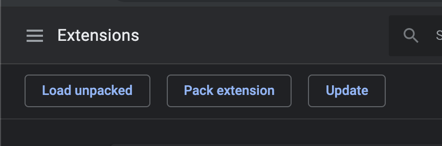
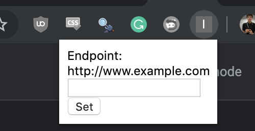
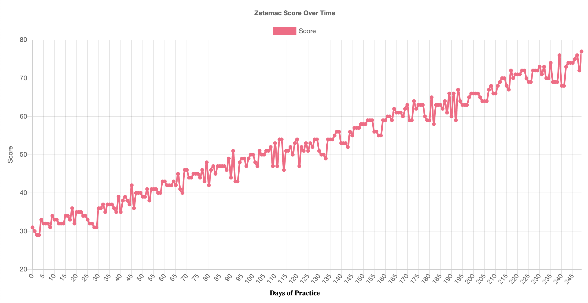

## What is Zetamac?

Zetamac is an arithmetic game where you are given two minutes to solve as many arithmetic problems as you can.

It's a really fun game, but the primary reason for using Zetamac is to prepare for [Quantitative Research](https://en.wikipedia.org/wiki/Quantitative_research) interviews at finance firms.  My friends and I regularly use Zetamac to prepare for these interviews, and we generally resort to manually recording our scores in excel to calculate our progress over time.

This can become cumbersome over time, and the visualization tools built into Excel are not as advanced as external options like MatPlotLib.

<p align="center">
  
  <p align="center">Excel Example</p>
</p>

## What does this do?

This chrome extension enables automatic exporting of your zetamac scores.  In the example used in this repo, we are sending the scores to a Lambda Function and saving the results to DynamoDB.

This extension allows you to automatically POST your score data to any URL in the following format:

```javascript
{"score": int(scoreVal)}
```

## Installation

Visit `chrome://extensions/` and click "Load Unpacked":

<p align="center">
  
</p>

Select the code from `extension/` and wait for chrome to finalize the third party extension install.  You should see a new icon in your Chrome toolbar when the extension is successfully installed.

The endpoint URL can be configured by clicking the extension icon in Chrome:

<p align="center">
  
</p>

You can set this endpoint to any URL that accepts a POST request containing Zetamac score information.

## Lambda Function

In the `lambda/` folder there is a basic lambda function that contains logic to accept POST requests containing zetamac score information sent from the Chrome extension.

The function saves the current score and timestamp to a DynamoDB table.

In addition, the Lambda function accepts GET requests to return the score data in chronological order.  This can be extremely useful for time series visualizations like this:

<p align="center">
  
</p>


