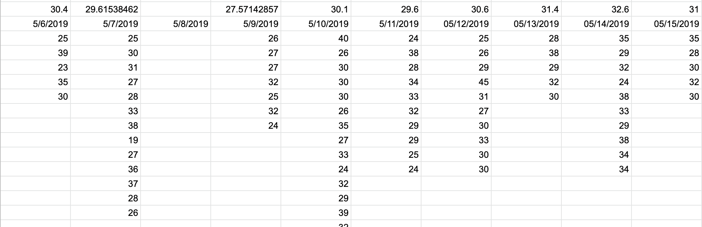

# zetamac-analyzer
Chrome extension to analyze zetamac scores

## What is Zetamac?

Zetamac is an arithmetic game where you are given two minutes to solve as many arithmetic problems as you can.

It's a really fun game, but the primary reason for using Zetamac is to prepare for [Quantitative Research](https://en.wikipedia.org/wiki/Quantitative_research) interviews at finance firms.  My friends and I regularly use Zetamac to prepare for these interviews, and we generally resort to manually recording our scores in excel to calculate our progress over time.

This can become cumbersome over time, and the visualization tools built into excel are not as advanced as external options like MatPlotLib.

  
  
Excel Example

